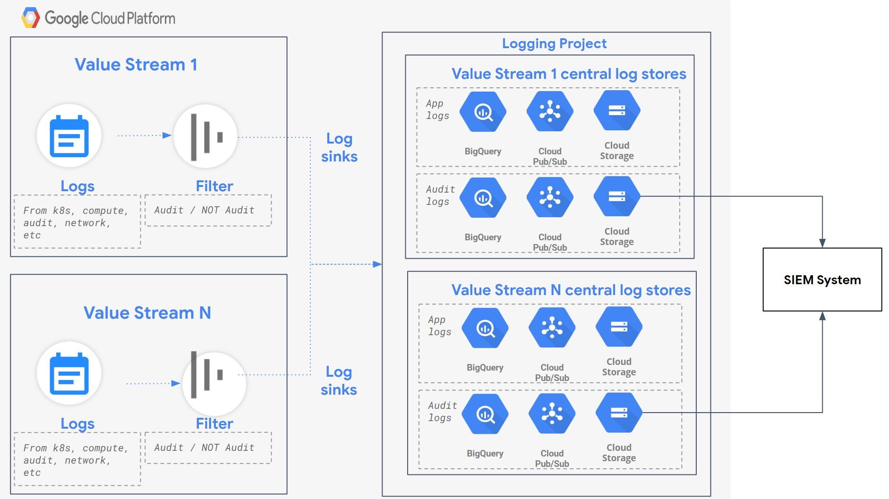

# CAP Logging

This module comprises of Terraform code for enabling centralised logging.

## Centralised Logging Considerations

The CAP logging architecture is based on the below mentioned considerations

Consideration | Description
------------- | -----------
Log Aggregation | Logs need to be aggregated and viewed centrally
Segregation of Security logs | Security logs need to be stored in a different data store than from other logs
Log Correlation | Ability to correlate between different types of logs is needed
Access Control | Logs need to be access controlled
Encryption | Logs need to be encrypted
Retention | Various log types need to be retained for a specified period of time
Integration with external log systems | Ability to integrate with external log systems on the enterprise - such as Splunk, etc. is needed

## Centralised Logging Architecture

### Logging Architecture Explained

* A logging project is created in the management domain. This project hosts log stores for each value stream
* There are two sets of central log stores created for each value stream
    * Audit / Security log store - contains only audit logs for the value stream
    * App log store - contains GCP platform service logs as well as application logs
* Each log store comprises of the following GCP services
    * GCS Bucket - for long term retention and archival of logs
    * Big Query data set - for near term analysis of logs
    * Pub-sub - for near real time analysis of logs
* GCS buckets holding the logs as well as Big Query data sets are encrypted using CMEK pattern with HSM backed keys
* GCS buckets holding the logs  as well as Big Query data sets have dataclassification = "highly confidential" for security log store
* Logs from the GCS bucket on the security log store can be forwarded to / consumed by an external SIEM system